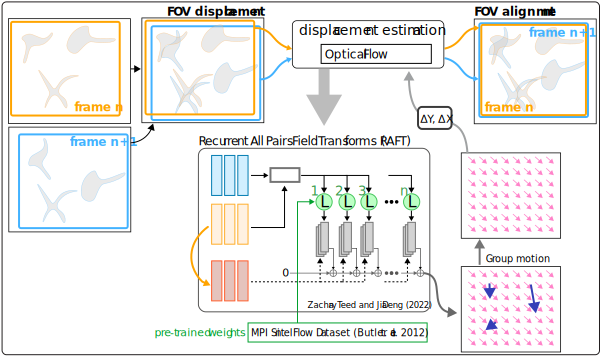

# Fiduciary-free frame alignment and image stabilization

Command-line tool and supplementary material to the paper: "Fiduciary-free frame alignment for robust time-lapse drift correction estimation in multi-sample cell microscopy"

This approach for jitter and drift correction is based on "[RAFT: Recurrent All Pairs Field Transforms for Optical Flow](https://arxiv.org/pdf/2003.12039.pdf) 
ECCV 2020  " by Zachary Teed and Jia Deng (ECCV 2020).

## samples

- DMSO (left: raw, right stabilized)

- RA (left: raw, right stabilized)

- KNK808 (left: raw, right stabilized)

<!--- This repo requires RAFT
git submodule add https://github.com/princeton-vl/RAFT -->
